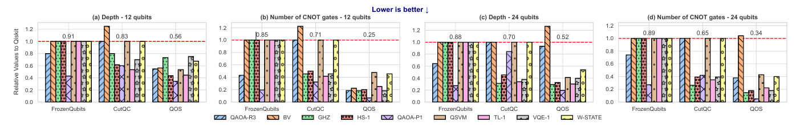
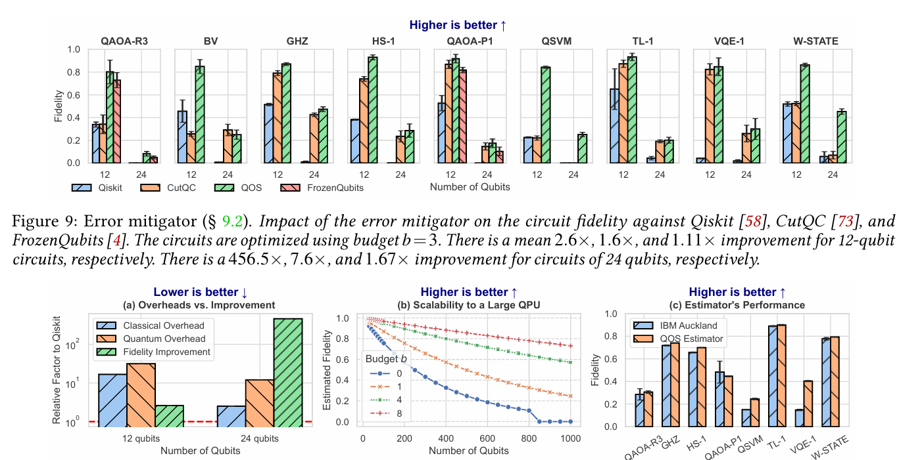

# 实验设计

## 系统文章的实验设计 2026/4/23

一篇成熟 systems paper 的实验部分会按这个顺序组织：

- 先证明问题存在；
- 再证明主机制有效；
- 再证明收益来源；
- 最后证明泛化性和鲁棒性。

## 如何解析论文的实验部分

读论文时，建议你带着一个固定表格去看图。每篇论文都记录下面 6 项：

- 这篇文章的“问题图”是什么
- 主指标有哪些
- baseline 有哪些
- workload 怎么分层
- 有没有 scale-up / stress test
- 有没有 ablation / sensitivity analysis

你会很快发现，真正值得学的不是某张图的视觉风格，而是图背后的实验结构模板
