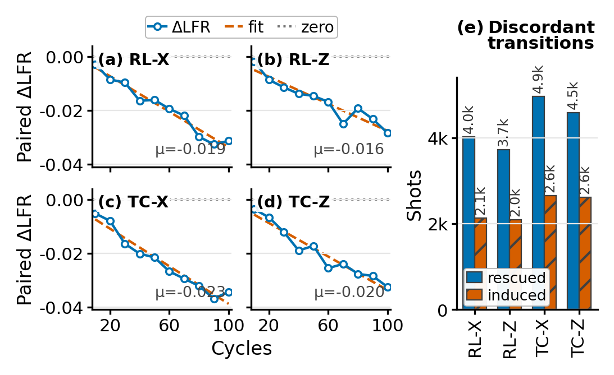
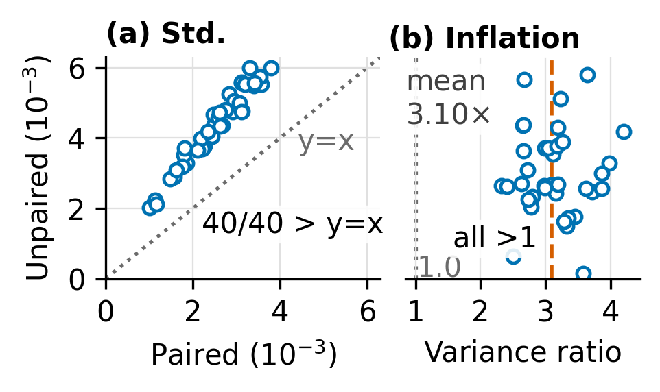
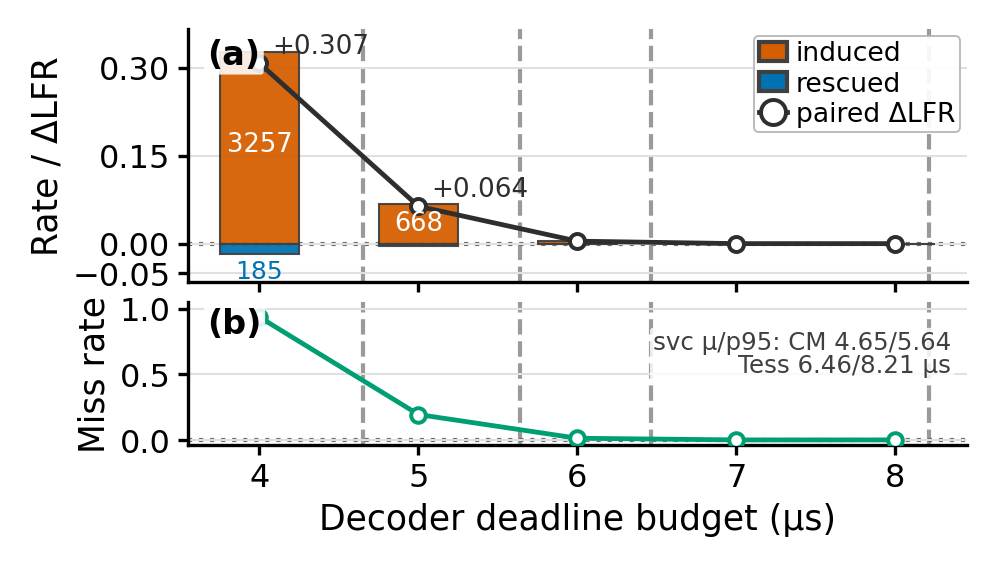
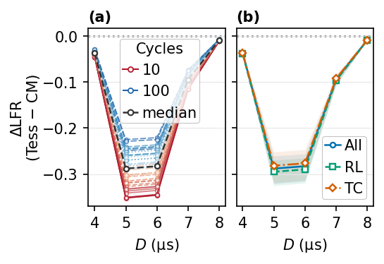

# 1. 背景

**FailureOps: Paired Replay Attribution for Logical Failures in Quantum Computing**

问题背景：QEC 正在从物理实验问题变成 systems 问题。

过去的 QEC 评估更多关注：

- logical failure rate 是否下降
- 某个 code-decoder configuration 是否更好
- decoder 在 aggregate level 上是否 outperform baseline

但系统视角下，我更关心的是：

**一次 logical failure 到底对哪个可控系统因素敏感？**

例如：

- 换 decoder backend，这个 failed shot 会不会被救回来？
- 换 decoder prior，会不会引入新的失败？
- decoder correction 超时，会不会把本来成功的 shot 变成失败？

核心缺口：现有 LFR 指标能说明“哪个配置整体更好”，但很难说明“同一批物理执行记录中的失败为什么会改变”。

---

# 2. 思想

FailureOps 的核心思想是：

**把 logical failure 看成一个 intervention-sensitive system event。**

不是重新采样两批 shots，也不是只比较两个 aggregate LFR，而是对同一批 detector-event records 做 paired replay。

### Paired replay

对同一条 shot record：

- baseline configuration 跑一遍
- intervention configuration 再跑一遍
- 保持 shot identity / seed / detector trace 不变
- 只改变一个可控系统因素

### 为什么这样做

这样可以直接回答：

**同一个 shot 的 outcome 是否因为 intervention 发生切换？**

也就是从“哪个配置整体更好”，转向“哪些失败被这个因素改变”。

### 我的归因对象

不是 failure 的物理根因，而是 failure 对系统可控因素的敏感性：decoder backend、decoder prior、runtime deadline。

---

# 3. 具体方法

FailureOps 的基本单位是一个 paired shot。

对同一个 detector record $d_i$：

- baseline configuration $C_0$ 得到 outcome $o_{0,i}$
- intervention configuration $C_1$ 得到 outcome $o_{1,i}$
- 比较两个 outcome，得到 transition type

| baseline | intervention | 含义 |
| --- | --- | --- |
| fail | success | rescued failure |
| success | fail | induced failure |
| fail | fail | unchanged failure |
| success | success | unchanged success |

真正用于归因的是 discordant pairs：rescued 和 induced。

### 核心指标

$$
\Delta LFR = \frac{I - R}{N}
$$

其中：

- $R$：rescued failures
- $I$：induced failures
- $N$：paired shots 总数

解释：

- $\Delta < 0$：净救回失败
- $\Delta > 0$：净引入失败

统计检验使用 exact McNemar test；多条件比较在每个 analysis scope 内做 Holm correction。

---

# 4. 实验效果

主实验比较：

**Correlated Matching → Tesseract**

实验设置：

- Google RL QEC real detector records
- 40 个 real-data conditions
- 每个 condition 10,000 shots
- 总计 400,000 paired shots
- 两个 decoder 都使用 SI1000 prior

主要结果：

- **40 / 40** conditions 都是 net-rescuing
- **39 / 40** conditions Holm correction 后显著
- mean paired ΔLFR = **−0.0195**
- rescued failures = **17,279**
- induced failures = **9,482**
- rescue / induce ratio = **1.82**

  
  
主实验：CM → Tesseract 在 40 个 real-data conditions 上稳定 net-rescuing

---

# 5. 实验分析

## 为什么必须 paired？

paired replay 不只是为了计算 ΔLFR。

它额外保留了：

- 哪些 shot 被救回
- 哪些 shot 被诱导失败
- 哪些 condition 对 intervention 最敏感

统计上，pairing 也降低方差：

- 主实验中 unpaired estimator std 平均膨胀 **1.75×**
- v2 corpus 中平均膨胀 **1.78×**

  

Paired vs. unpaired：不配对会损失 transition semantics，并增加估计方差

## 为什么有 systems 意义？

deadline replay 说明：

**decoder 不只是 accuracy object，还是 runtime service。**

当 deadline 太紧时，correction late 会把原本成功的 shot 变成 failure：

- 4 μs budget：miss rate 93.6%
- induced failures = 3,257
- rescued failures = 185
- ΔLFR = **+0.307**

  

Runtime deadline：过紧 deadline 会把 intervention 从 neutral / rescuing 推向 inducing

---

# 6. 后续工作开展

下一步我想把 FailureOps 从 methodology 继续推进到 QEC systems 工具。

第一，补强 artifact 和 reproducibility：

- 固化 public-data pipeline
- 整理 claim-audit table
- 确保每个 figure / table 都可复现

第二，扩展 intervention family：

- decoder ensemble / fallback
- confidence-aware decoder selection
- latency-budget-aware decoder switching
- prior adaptation across workload / code family

第三，更靠近 live-system setting：

- control-stack latency model
- online decoder service trace
- backlog / queueing behavior
- deadline miss 对 logical workload 的 end-to-end 影响

最终目标：

**把 FailureOps 做成 QEC systems 里的 failure profiler，服务于 decoder selection 和 runtime decision。**

  
  
后续方向：从 attribution 走向 latency / policy / runtime decision

