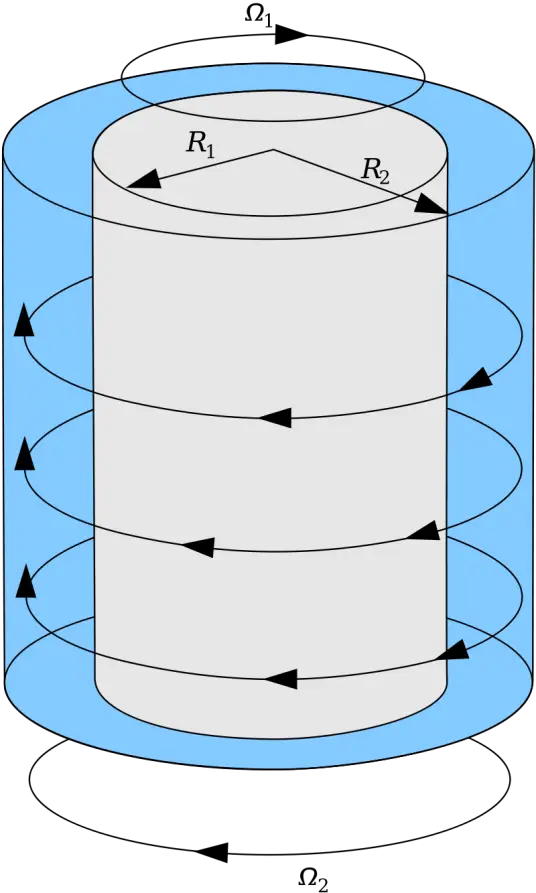
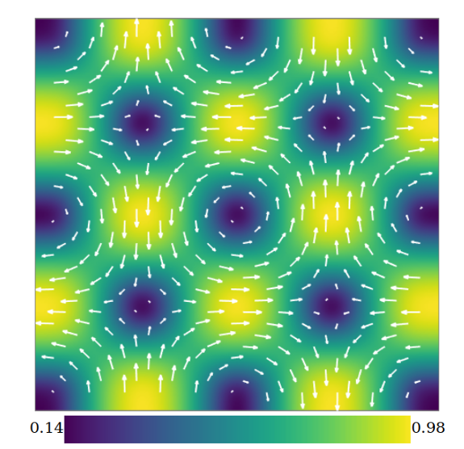

# 不同初态和哈密顿量

## 引用了 Simulating unsteady flows on a superconducting quantum processor 的文献的相关调查

1. [Enabling Large-Scale and High-Precision Fluid Simulations on Near-Term Quantum Computers](https://arxiv.org/abs/2406.06063)

- steady Poiseuille flow and unsteady acoustic wave propagation
  - Poiseuille flow 泊肃叶流

  - 量子经典混合算法

2. [Quantum spin representation for the Navier-Stokes equation](https://journals.aps.org/prresearch/abstract/10.1103/PhysRevResearch.6.043130)

- 给出模拟粘性流体的量子表示方法

3. 

## 不同流体

### 粘性方腔流

### 泊肃叶流

## 不同涡流

### 泰勒-库埃特流(Taylor-Green Vortex)

夹在两个旋转圆柱之间缝隙中的粘性流体

一些已有研究：

[Integrating Quantum Algorithms Into Classical Frameworks](https://arxiv.org/abs/2406.19996)

- 流体案例：Taylor-Green Vortex(计算流体力学研究常用案例)

- 混合经典算法

## 不同哈密顿量（主要区别在于势能项V）

### 粘性耗散

$V=iv\nabla^2\ln\rho $，对应纳维-斯托克斯方程的耗散项

### 旋转克里尼奥力

$v=-f_c(xu_y-yu_x)$，对应旋转坐标系下的克里尼奥力

### 布西内斯克近似下的热浮力效应

$V=g\beta Ty$

### 磁流体动力学 (MHD) 中的洛伦兹力

$ $
